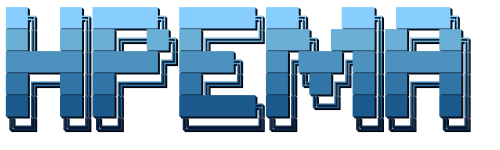

<div align="center">
  
</div>

<div align="center">

**High-assurance code generation for safety-critical software.**

[](https://python.org)
[](https://dafny.org)
[](LICENSE)
[](https://www.faa.gov)

</div>

---

## Overview

HPEMA (Hierarchical Policy-Enforced Multi-Agent) is a multi-agent pipeline that generates, verifies, and certifies source code against safety standards such as DO-178C, MISRA-C, and NASA-STD-8739.8. It was built for aerospace and safety-critical engineering contexts where the consequences of a software defect are measured not in dollars but in lives.

Unlike every other AI coding assistant available today, HPEMA does not rely on model behavior to produce correct output. Instead, it enforces three independent, mathematically grounded guarantees on every piece of code it produces: structural correctness through constrained decoding, logical correctness through formal proof, and regulatory correctness through live policy enforcement. Any one of these guarantees in isolation is impressive. Together, they form a defense-in-depth architecture for AI-generated code.

---

## The Problem With AI-Generated Code Today

Every existing agentic coding system, from GitHub Copilot to Devin to CrewAI pipelines, shares the same fundamental design flaw: they ask the language model to behave correctly and hope that it does.

In practice, this means two things. First, the structure of the model's output is probabilistic. A model that generates JSON nine times out of ten will eventually produce malformed output on the tenth call, silently corrupting downstream state. There is no hard enforcement; only the statistical weight of training examples. Second, the logical content of the output is unverifiable. A model that claims its generated function handles all edge cases is making a probabilistic statement; it has seen similar patterns in training and is predicting that the pattern applies here. Testing can show that specific cases pass, but testing can never prove that all possible inputs are handled correctly.

For general-purpose software development, this is an acceptable trade-off. For a flight-critical altitude hold controller, a medical device ventilator scheduler, or a nuclear plant sensor aggregator, it is not.

Existing solutions to this problem fall into three categories, all of which are inadequate. The first category is prompt engineering: crafting careful instructions that nudge the model toward correct behavior. This is fragile and non-transferable; a prompt that works on one model often fails on another, and there is no formal guarantee attached to any output. The second category is extensive testing: running large test suites against generated code to increase confidence. Testing is valuable but fundamentally limited; as Dijkstra observed, testing can only demonstrate the presence of bugs, never their absence. The third category is human review: placing an expert engineer in the loop to audit every output. This is slow, expensive, and does not scale; it also reintroduces the human error that automation is meant to eliminate.

HPEMA takes a different approach. Instead of trying to improve the probabilistic behavior of language models, it accepts that models are probabilistic and builds deterministic guarantees around them at three separate layers.

---

## Three Layers of Deterministic Assurance

### Layer 1: Constrained Decoding (Structural Safety)

Every agent in HPEMA produces output through a constrained decoding mode that enforces a JSON schema at the token level during generation. The model literally cannot emit a token sequence that would violate the output schema. This is not a post-processing step and not a retry loop; it is a formal grammar constraint applied to the decoder at inference time.

Concretely: the Actor agent must produce a `CodeCandidate` object containing `source_code`, `dafny_spec`, and `reasoning_trace`. The Checker agent must produce a `CheckerReport` containing `verdict`, `issues`, and `test_cases`. The Policy agent must produce a `PolicyVerdict` containing `compliant`, `risk_level`, `violations`, and `recommendations`. None of these agents can produce partial output, unexpected fields, or unstructured text. The output is machine-parseable by construction, not by convention.

This is why HPEMA can run with zero human supervision over the inter-agent communication layer. There is no need to check whether the Actor's output is valid before passing it to the Checker; the decoding process has already ensured that it is.

### Layer 2: Formal Verification with Dafny (Logical Safety)

Alongside source code, the Actor agent generates a formal Dafny specification: a mathematical description of what the code must do, expressed as `requires` preconditions, `ensures` postconditions, and loop invariants. The Dafny architect agent then refines this specification into a standalone, self-contained Dafny method. The Dafny verifier, a Z3-backed theorem prover, then either proves that the specification holds for all possible inputs, or produces a concrete counterexample showing exactly which input causes the specification to fail.

This is the key distinction between formal verification and testing. A test suite might check ten thousand inputs and find zero failures; formal verification proves that no failure exists across the infinite space of all possible inputs. When Dafny reports "verified," it is not a statistical statement; it is a mathematical proof.

When verification fails, the solver's counterexample is fed back to the Dafny architect for the next cycle. This inner loop runs up to three times per outer iteration, giving the system multiple chances to produce a correct specification before the Checker and Policy agents run. Verified specifications are cached and reused in subsequent iterations when possible, avoiding redundant proof work.

### Layer 3: RAG-Backed Policy Enforcement (Compliance Safety)

The Policy agent does not apply general engineering intuition to compliance review. Instead, it retrieves specific clauses from safety standards via a vector database (ChromaDB), then cites those clauses by section number in its compliance verdict. Every violation in the output references the exact standard clause it violates; for example, "DO-178C §6.4.4.2.b: The limiter function fails to handle integer overflow."

This matters for two reasons. First, the citations are auditable. A Boeing engineer or FAA auditor can trace every compliance decision back to its source document. Second, the knowledge base is updatable without retraining. When Boeing publishes a new revision of an internal Software Development Plan, the document is dropped into the standards directory and ingested automatically; no code change, no model fine-tuning, no prompt rewriting is needed. The Policy agent enforces whatever is in the knowledge base.

### The Compound Effect

Each layer catches failures that the others would miss. Constrained decoding ensures that inter-agent communication is always parseable, but it says nothing about whether the code is logically correct. Formal verification ensures logical correctness within the stated specification, but it says nothing about whether the specification covers the right requirements. Policy enforcement ensures that the code complies with the applicable standard, but it cannot mathematically prove correctness. The three layers together close these gaps. This is defense in depth applied to AI code generation.

---

## How the Pipeline Works

A single pipeline run proceeds through the following sequence. The orchestrator drives the loop; the language models produce content within each stage; the verifier and test runner execute against that content and report results.

```
  User Prompt (requirement text)
         │
         ▼
  ┌─────────────────────────────────────────┐
  │              ORCHESTRATOR               │
  │  state machine; deterministic control   │
  └─────────────────────────────────────────┘
         │
         │  (loops up to max_iterations)
         ▼
  ┌──────────────┐
  │  ACTOR AGENT │  generates source code + Dafny spec
  └──────┬───────┘
         │
         ▼
  ┌──────────────────────────────┐
  │  DAFNY ARCHITECT (up to 3x)  │  refines formal specification
  │  + DAFNY VERIFIER            │  Z3 theorem prover; counterexample on fail
  └──────────────┬───────────────┘
                 │  verified spec (or skip if unavailable)
                 ▼
  ┌──────────────────────────────┐
  │  CHECKER AGENT               │  code review; generates test cases
  │  + TEST RUNNER (pytest)      │  executes generated tests on actual code
  └──────────────┬───────────────┘
                 │
                 ▼
  ┌──────────────────────────────┐
  │  POLICY AGENT                │  retrieves standard clauses via RAG
  │  + ChromaDB retriever        │  produces compliance verdict with citations
  └──────────────┬───────────────┘
                 │
         [ALL PASS?]
         │       │
        YES      NO
         │       │
         │       └──── compose prioritized feedback ──► Actor (next iteration)
         ▼
  AWAITING_APPROVAL
  code + proof + audit trail
```

Each iteration ends by computing a weighted score: 1.0 for checker pass, a ratio of `tests_passed / tests_total` for test results, 0.5 for Dafny verification, 0.25 for having any Dafny spec, and 1.0 for policy compliance. The highest-scoring iteration is retained as the best result. If no iteration achieves full convergence, the best-scored code is still exposed as `final_code` so that selective re-runs (run checker, run policy, run Dafny) remain available.

Feedback is prioritized before being sent back to the Actor. When a majority of tests are already passing, the feedback message opens with an explicit directive to fix only the failing tests rather than rewrite working logic. Policy violations and minor style issues are suppressed until the fundamental correctness problems are resolved. This prevents the Actor from destabilizing a nearly-correct solution in pursuit of cosmetic improvements.

---

## The Agentic Build Interface

HPEMA's REPL is intent-driven. When you type in build mode, your input is classified before anything runs. A fast heuristic path handles the common cases in zero milliseconds; a small LLM call handles genuinely ambiguous inputs in one to two seconds.

**Generate (full pipeline):** Any substantive requirement description, more than eight words with no agent keywords, triggers a full pipeline run from the Actor through Policy.

**Selective re-run:** If you have a result from a previous run and want to iterate on it without regenerating code, you can run any individual agent. HPEMA understands natural language variants of these requests:

```
hpema › run the checker again
hpema › re-run dafny on the last code
hpema › check policy compliance again
hpema › run_checker
```

Each selective re-run uses the exact code from the best iteration of the last pipeline run. It instantiates only the requested agent, bypasses the orchestrator, and emits the same streaming events that the display layer already knows how to render. The result is indistinguishable from a full pipeline run except that it is substantially faster.

**Converse (inline chat):** Questions, greetings, and off-topic messages are routed to the Actor model in chat mode. No pipeline is triggered. Responses stream in real time and do not affect pipeline state.

```
hpema › hi
hpema › what does requires mean in Dafny?
hpema › why did the checker flag that issue?
```

You can also explicitly switch between build and chat mode with `Shift+Tab` or the `/mode` command.

---

## Installation

### Prerequisites

| Tool | Version | Notes |
|------|---------|-------|
| Python | 3.12 recommended; 3.11 acceptable | `brew install python@3.12` on macOS |
| Git | any | system package manager |
| Dafny | 4.x | only needed for `checker` or `policy` stage; see below |

### 1. Clone and Install Python Dependencies

```bash
git clone <repo-url>
cd Capstone

python3.12 -m venv .venv
source .venv/bin/activate        # on Windows: .venv\Scripts\activate

pip install -r requirements.txt
```

The full `requirements.txt` includes `torch`, `sentence-transformers`, and `chromadb` for the RAG and policy layer. If you only need the Actor and Checker (no policy enforcement), set `stage: "checker"` in your config and these packages are unused.

### 2. Create Your `.env`

```bash
cp .env.example .env
```

Open `.env` and fill in your API key and config path:

```bash
# Your provider API key; pick whichever provider you are using
export NVIDIA_API_KEY=nvapi-xxxxxxxxxxxxxxxxxxxx

# Point HPEMA at your local config file (see step 3)
export HPEMA_CONFIG=local/configs/hpema_config.local.yaml

# Suppress ChromaDB telemetry noise
export ANONYMIZED_TELEMETRY=False
```

Supported key environment variables, by provider:

| Variable | Provider |
|----------|----------|
| `NVIDIA_API_KEY` | NVIDIA NIM (`integrate.api.nvidia.com`) |
| `OPENAI_API_KEY` | OpenAI |
| `GROQ_API_KEY` | Groq |
| `HPEMA_API_KEY` | ARC cluster vLLM (any non-empty value works) |

HPEMA auto-loads `.env` from the project root regardless of the working directory you launch from, so you only need to fill this in once.

### 3. Pick or Write a Config File

HPEMA loads whichever file `HPEMA_CONFIG` points to. Two ready-made configs are included in `local/configs/`:

| File | Model Assignments |
|------|------------------|
| `hpema_config.local.yaml` | Mistral Large 3 for Actor and Policy; Step-3.5-Flash for Checker and Dafny Architect |
| `hpema_config.local1.yaml` | Mistral Large 3 across all four agents |

To activate one, set the env var:

```bash
export HPEMA_CONFIG=local/configs/hpema_config.local.yaml
```

#### Anatomy of a config file

```yaml
models:
  actor:
    endpoint: "https://integrate.api.nvidia.com/v1"   # any OpenAI-compatible base URL
    model: "mistralai/mistral-large-3-675b-instruct-2512"
    api_key_env: "NVIDIA_API_KEY"                     # name of the env var holding the key
    # optional: enable extended thinking for supported models
    # extra_body:
    #   chat_template_kwargs:
    #     enable_thinking: true
    #     thinking_budget: 2000

  checker:        # same structure; can use a different provider than actor
    endpoint: "..."
    model: "..."
    api_key_env: "..."

  policy:         { ... }
  dafny_architect: { ... }

policies:
  standards_dir: "data/standards"    # directory of RAG source documents
  chromadb_dir:  "data/chromadb"     # vector database; auto-created on first run
  default_standard: "DO_178C"

verification:
  prover: "dafny"
  timeout_seconds: 120
  binary_path: "/opt/homebrew/bin/dafny"    # absolute path to the dafny binary
  solver_path: "/opt/homebrew/bin/z3"       # optional; needed on macOS

pipeline:
  max_iterations: 3
  require_human_approval: false
  stage: "policy"                           # "actor" | "checker" | "policy"
```

#### Stage selection

The `stage` field controls how far each pipeline run goes:

| Stage | Agents Active | When to Use |
|-------|--------------|-------------|
| `"actor"` | Actor only | Fastest; raw code generation with no review |
| `"checker"` | Actor + Dafny Architect + Dafny Verifier + Checker + pytest | Code review and formal proof; no compliance audit |
| `"policy"` | Full pipeline, all four agents | Complete assurance for submission-quality output |

Every agent can use a different provider and model. The pipeline auto-detects capability flags (JSON schema support, thinking parameters, system role support) from a built-in model family profile registry and adjusts API calls accordingly.

### 4. Install Dafny

Dafny is only required when `stage` is `"checker"` or `"policy"`.

#### macOS

```bash
brew install dotnet
brew install dafny
which dafny              # e.g. /opt/homebrew/bin/dafny

# macOS often cannot find Z3 automatically; install separately
brew install z3
which z3                 # e.g. /opt/homebrew/bin/z3
```

Set both paths in your config:

```yaml
verification:
  binary_path: "/opt/homebrew/bin/dafny"
  solver_path: "/opt/homebrew/bin/z3"
```

#### Linux

```bash
# Install .NET 8 runtime (required by Dafny)
wget https://packages.microsoft.com/config/ubuntu/22.04/packages-microsoft-prod.deb
sudo dpkg -i packages-microsoft-prod.deb
sudo apt-get update && sudo apt-get install -y dotnet-runtime-8.0

# Download and extract Dafny
DAFNY_VERSION=4.9.0
wget https://github.com/dafny-lang/dafny/releases/download/v${DAFNY_VERSION}/dafny-${DAFNY_VERSION}-x64-ubuntu-20.04.zip
unzip dafny-*.zip -d ~/dafny
```

Set the path in your config:

```yaml
verification:
  binary_path: "/home/<you>/dafny/dafny"
```

#### All platforms: pre-built binary

Download from [github.com/dafny-lang/dafny/releases](https://github.com/dafny-lang/dafny/releases). Choose the archive for your OS, extract it, and set `binary_path` in your config to the `dafny` executable inside.

Verify the install before running HPEMA:

```bash
dafny --version
# Dafny 4.x.x
```

### 5. Launch

```bash
source .env
python -m cli.main
```

HPEMA will animate a connectivity check against each configured model endpoint and then drop into the interactive prompt. If an endpoint is unreachable, it shows a retry indicator; press `Ctrl+S` to skip it and proceed.

```
hpema ›
```

---

## Using the CLI

### Your First Generation

Type a requirement in plain English. HPEMA classifies your input, determines that you want to generate code, and runs the full pipeline.

```
hpema › Write a bounded FIFO queue in Python with O(1) enqueue and dequeue, DO-178C compliant
```

You will see each agent panel appear as it completes: Actor streaming code, Dafny Architect formalizing the specification, Dafny Verifier proving it, Checker auditing the code and generating test cases, pytest executing those tests, and Policy auditing compliance against the standard you configured.

At the end, HPEMA shows the best-scored iteration's code with syntax highlighting, a summary of which checks passed and failed, and the run ID for audit purposes.

### Selective Re-Runs

After a pipeline run, the last generated code is kept in session memory. You can re-run any individual agent on it without triggering a full pipeline:

```
hpema › run the checker again
hpema › re-run dafny
hpema › check policy compliance
hpema › run_checker
```

This is useful when you have good code but want to iterate on a specific verification step; for example, if Dafny verification failed but the code logic looks correct, you can ask HPEMA to try Dafny again after adjusting the config or simply seeing if the LLM produces a different specification on the next attempt.

### Inline Questions

Questions and conversational messages go directly to the Actor model as a knowledgeable assistant; no pipeline is triggered:

```
hpema › what is a requires clause in Dafny?
hpema › why does DO-178C care about integer overflow?
hpema › what does the checker verdict "warn" mean?
```

### Mode Switching

Press `Shift+Tab` to toggle between **Build** mode (pipeline on generation intent) and **Chat** mode (all input goes to the Actor as a chat message, pipeline never runs). The current mode is shown in the status bar.

```
hpema › /mode chat      # switch to chat mode explicitly
hpema › /mode build     # switch back to build mode
```

### All Commands

| Command | Effect |
|---------|--------|
| `/stage actor` | Code generation only; no verification |
| `/stage checker` | Actor + Dafny + Checker + pytest |
| `/stage policy` | Full pipeline |
| `/iterations N` | Set maximum retry iterations (default: 3) |
| `/standard DO_178C` | Set safety standard for this session |
| `/language Python` | Set target language; options: Python, C, SPARK_Ada |
| `/run-tests off` | Skip pytest execution |
| `/run-tests on` | Re-enable pytest |
| `/mode build` | Switch to build mode |
| `/mode chat` | Switch to chat mode |
| `/config` | Show active config file and model assignments |
| `/config path/to/file.yaml` | Switch to a different config file |
| `/last` | Re-display the last run's full output |
| `/checker` | Verbose Checker report for last run |
| `/checker N` | Verbose Checker report for iteration N |
| `/dafny` | Full Dafny architect output and solver output |
| `/pytest` | Full pytest output |
| `/history` | Summary of all runs this session |
| `/history N` | Show only the last N runs |
| `/audit` | Traceability matrix for the last run |
| `/setup` | Interactive API key and endpoint configurator |
| `/scroll` | Enter terminal scroll mode for reading long output |
| `/help` | Show all commands |
| `/quit` or `/exit` | Exit HPEMA |

---

## Understanding the Output

Each agent produces a live-updating panel as it runs. Here is what each panel tells you:

**Actor:** Shows the language, whether a Dafny spec was generated alongside the code, and the Actor's reasoning trace (its chain-of-thought explanation for design decisions). The full source code appears at the end of the run.

**Dafny Architect:** Shows the generated formal specification in Dafny syntax; `requires` preconditions, `ensures` postconditions, and loop invariants. If the Architect runs multiple cycles (up to three), each cycle is shown separately.

**Dafny Verifier:** Shows whether Z3 proved the specification, the solver output, any failing assertions, and execution time. A green border means proven; red means a counterexample was found. Failing assertions feed back directly to the Dafny Architect for the next cycle.

**Checker:** Shows the overall verdict (pass / warn / fail), all issues by severity (critical, major, minor, info), and the test cases the Checker generated. The Checker's verdict gates convergence; a FAIL verdict means the iteration does not pass regardless of other results.

**Test Runner:** Shows how many tests were collected, how many passed, how many failed, and the raw pytest output on failure. Test results feed back to the Actor as prioritized feedback; a high pass rate triggers a focused "fix only the failing tests" directive rather than a full rewrite request.

**Policy:** Shows the compliance verdict (compliant / non-compliant), the risk level (low / medium / high / critical), each violation with its standard clause citation, and recommendations. Policy compliance gates convergence in the full pipeline stage.

**Pipeline summary:** At the end of each run, HPEMA shows total time, the number of iterations used, which iteration scored highest, and the run ID. The run ID corresponds to a JSONL audit log in `logs/audit/`.

---

## Self-Hosting with vLLM (Local or Remote GPU)

If you have access to a machine with a GPU and prefer not to rely on external API providers, you can run HPEMA entirely against your own vLLM server. vLLM exposes an OpenAI-compatible API; from HPEMA's perspective it is identical to any other endpoint. No external API keys are required, and the entire pipeline runs air-gapped within your own infrastructure.

### Prerequisites

- A machine with at least one NVIDIA GPU (16 GB VRAM minimum for a 7B model; 40 GB for 70B-class models)
- Python 3.10+ on that machine
- CUDA 12.x drivers

### 1. Install vLLM

```bash
pip install vllm
```

### 2. Start a vLLM Server

Launch one vLLM instance per agent role, each on a different port. You can use the same model for all agents on a single GPU, or different models on different GPUs:

```bash
# Single model for all agents (simplest setup)
python -m vllm.entrypoints.openai.api_server \
  --model mistralai/Mistral-7B-Instruct-v0.3 \
  --port 8001

# Or, one model per agent role on multiple GPUs
python -m vllm.entrypoints.openai.api_server \
  --model Qwen/Qwen2.5-Coder-32B-Instruct \
  --port 8001 --tensor-parallel-size 2 &    # actor

python -m vllm.entrypoints.openai.api_server \
  --model microsoft/Phi-4 \
  --port 8002 &                              # checker + dafny architect

python -m vllm.entrypoints.openai.api_server \
  --model mistralai/Mistral-Small-3.2-24B-Instruct \
  --port 8003 &                              # policy
```

Wait until each server prints `Application startup complete.` before proceeding.

### 3. Point HPEMA at Your Server

Create a config file that references your local endpoints:

```yaml
# local/configs/hpema_config.vllm.yaml
models:
  actor:
    endpoint: "http://localhost:8001/v1"
    model: "mistralai/Mistral-7B-Instruct-v0.3"
    api_key_env: "HPEMA_API_KEY"            # set to any non-empty string

  checker:
    endpoint: "http://localhost:8001/v1"    # same server if sharing one GPU
    model: "mistralai/Mistral-7B-Instruct-v0.3"
    api_key_env: "HPEMA_API_KEY"

  policy:
    endpoint: "http://localhost:8001/v1"
    model: "mistralai/Mistral-7B-Instruct-v0.3"
    api_key_env: "HPEMA_API_KEY"

  dafny_architect:
    endpoint: "http://localhost:8001/v1"
    model: "mistralai/Mistral-7B-Instruct-v0.3"
    api_key_env: "HPEMA_API_KEY"

policies:
  standards_dir: "data/standards"
  chromadb_dir: "data/chromadb"
  default_standard: "DO_178C"

verification:
  prover: "dafny"
  timeout_seconds: 120
  binary_path: "/usr/local/bin/dafny"

pipeline:
  max_iterations: 3
  stage: "policy"
```

```bash
export HPEMA_API_KEY=local          # any non-empty value; vLLM ignores it
export HPEMA_CONFIG=local/configs/hpema_config.vllm.yaml
python -m cli.main
```

### 4. Constrained Decoding

vLLM supports JSON schema constrained decoding natively via `guided_json`. HPEMA detects this capability automatically from the model family profile and enables it when available. This is the strongest form of the structural safety guarantee: the model cannot emit tokens that violate the output schema, at the token level, during generation. No post-processing or retry loop is needed.

If your model family profile does not list `supports_json_schema: true`, HPEMA falls back to prompt-only structured output with JSON extraction; the pipeline still works but the structural guarantee becomes probabilistic rather than formal.

### Remote GPU Access

If your GPU machine is not local (a university HPC cluster, a cloud VM, a coworker's workstation), the setup is identical except the endpoint URL uses the remote host's IP or hostname instead of `localhost`. Start vLLM on the remote machine, ensure the port is reachable from your local machine (SSH tunnel or open firewall rule), and set the endpoint accordingly:

```yaml
# Config on your local machine, pointing at the remote vLLM server
models:
  actor:
    endpoint: "http://192.168.1.50:8001/v1"     # remote host IP
    model: "mistralai/Mistral-7B-Instruct-v0.3"
    api_key_env: "HPEMA_API_KEY"
```

Or through an SSH tunnel:

```bash
# On your local machine: forward remote port 8001 to local port 8001
ssh -L 8001:localhost:8001 user@remote-gpu-host

# Then use localhost in your config as if the server were local
```

---

## Project Structure

```
Capstone/
├── assets/
│   └── hpema-logo.svg              gradient logo for README
│
├── cli/
│   ├── main.py                     entry point; typer app
│   ├── repl.py                     interactive REPL; intent dispatch; /commands
│   ├── display.py                  streaming display; agent panels; live spinners
│   ├── intent.py                   intent classifier; heuristic + LLM fallback
│   └── runner.py                   pipeline runner; selective agent runners
│
├── backend/
│   ├── config.py                   config loader; ~/.hpema/ isolation
│   ├── api/schemas/
│   │   ├── agents.py               Pydantic models: CodeCandidate, CheckerReport,
│   │   │                           DafnySpec, PolicyVerdict, TestRunResult
│   │   └── pipeline.py             PipelineRequest, PipelineState, StreamEvent
│   └── services/
│       ├── orchestrator.py         pipeline state machine; scoring; best-iteration tracking
│       ├── feedback.py             prioritized feedback composition for Actor
│       ├── agents/
│       │   ├── base.py             BaseAgent ABC; streaming; structured parse
│       │   ├── actor.py            code + Dafny spec generation
│       │   ├── checker.py          code review + test case generation
│       │   ├── dafny_architect.py  formal specification generation and refinement
│       │   └── policy.py           compliance audit with RAG context
│       ├── llm/
│       │   ├── client.py           async OpenAI-compatible client; constrained decoding
│       │   ├── model_registry.py   agent-to-endpoint mapping from config
│       │   ├── profiles.py         model family capability profiles
│       │   └── prompts/            system prompts for each agent role
│       ├── verification/
│       │   ├── dafny_runner.py     Dafny subprocess wrapper; Z3 integration
│       │   └── contract_extractor.py  extracts requires/ensures from verified specs
│       ├── rag/
│       │   └── retriever.py        ChromaDB vector search; standards ingestion
│       ├── testing/
│       │   └── runner.py           pytest execution on generated code + tests
│       └── audit/
│           └── logger.py           append-only JSONL + SQLite audit trail
│
├── data/
│   ├── standards/                  RAG source documents (DO-178C, MISRA-C, NASA)
│   └── chromadb/                   vector database; auto-created on first run
│
├── local/configs/                  local API config files (gitignored credentials)
├── ml/slurm/                       SLURM scripts and tmux launcher for ARC
├── logs/
│   ├── hpema.log                   full debug log
│   ├── actor.log                   Actor: every prompt + raw response
│   ├── checker.log                 Checker: every prompt + raw response
│   ├── policy.log                  Policy: every prompt + raw response
│   └── audit/                      per-run JSONL audit trail ({run_id}.jsonl)
│
├── hpema_config.yaml               default config (ARC vLLM endpoints)
├── hpema_config.local.yaml         local API config (uncommitted overrides)
├── pyproject.toml
└── requirements.txt
```

---

## Troubleshooting

**An endpoint shows "Retrying..." on startup and never connects.**
The endpoint URL is unreachable or the API key is wrong. Press `Ctrl+S` to skip and proceed; HPEMA will surface the error on the first actual request with full detail. Check that the `endpoint` in your config matches the provider's base URL exactly, including the `/v1` suffix, and that the `api_key_env` variable is exported in your shell session.

**`dafny: command not found`**
The `binary_path` in your config points to the wrong location, or Dafny is not installed. Run `which dafny` to find the correct path and set it in your config. If `which dafny` returns nothing, Dafny is not installed; see the installation section above.

**Policy stage shows parse failures or empty output on first run.**
HPEMA auto-detects unsupported features (JSON schema constrained decoding, thinking parameters, system role) per model family and retries with adjusted parameters. One extra round-trip is expected the first time an endpoint is contacted by a new process. Subsequent calls within the same session use the cached profile.

**ChromaDB errors on the policy stage.**
The `data/chromadb/` directory is created and ingested from `data/standards/` automatically on first run. If it becomes corrupted (interrupted write, disk full), delete the directory and restart; ingestion will repeat.

**`HPEMA_CONFIG` is not being picked up.**
Make sure you used `export` rather than plain assignment, and sourced the file in the same shell session that runs HPEMA: `source .env`. Assignment without `export` sets a shell variable but not an environment variable, so child processes do not inherit it.

**The Actor rewrites working code each iteration instead of fixing only the failures.**
This indicates a run where the feedback composition is not correctly detecting a high pass rate. Check that `test_result.executed` is true in the pipeline log (the tests actually ran); if pytest could not collect any tests, the pass ratio defaults to 1.0 and the suppression directive does not apply. Set `/stage checker` and then `/run-tests on` to confirm that tests are executing.

**Dafny verification always fails with "method call is not allowed in expression context."**
The Dafny architect generated a spec that calls a Dafny method inside an expression position (ensures clause, requires clause). This is a Dafny language constraint: only pure functions, not methods, may appear in specification expressions. The architect's system prompt addresses this, but some LLMs ignore it intermittently. Running `/dafny` shows the full solver output; you can also re-run Dafny with `run dafny again` to get a different spec from the architect.

**The pipeline always picks iteration 1 as best even though later iterations look better.**
Prior to the scoring fix in this branch, the score comparison used `>` (strict greater than), which meant equal-scored iterations always kept the earlier one. The fix changes this to `>=`, so the last equally-scored iteration wins. Additionally, test scores are now computed as `passed/total` ratios rather than binary pass/fail, so an iteration with 8 of 9 tests passing scores higher than one with 6 of 10 tests passing even if both technically "failed" the convergence threshold.

---

## Design Philosophy

HPEMA is intentionally not built on LangGraph, CrewAI, or any existing agent framework. Those frameworks optimize for flexibility and free-form agent interaction; HPEMA optimizes for auditability and deterministic control flow. The orchestrator is a straightforward Python state machine of roughly three hundred lines. Every decision it makes is explicit in the code. Every piece of inter-agent data is a typed Pydantic model. Every agent call is logged with its full prompt and raw response.

This is the correct trade-off for aerospace software. A flight certification authority does not accept "the framework decided"; it requires a traceable, reproducible record of every decision in the software development process. HPEMA produces that record automatically.

The plug-and-play configuration design means that any organization can substitute their own models, standards documents, and infrastructure by editing a single YAML file. Boeing can point HPEMA at an internal LLM endpoint and drop their Software Development Plan into the standards directory; the pipeline enforces it without any code modification.
